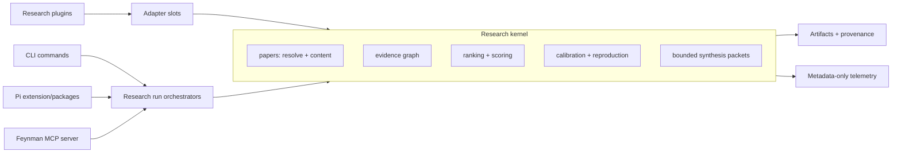

# Proposed Architecture

## The Pick

Feynman should become a small research kernel with source/scoring/artifact adapters around it.

That means the next code work is not another feature. It is a boundary refactor:



The kernel owns research truth. CLI, Pi commands, MCP, and plugins are just ways to enter or extend that kernel.

## Module Split

### First Split: `src/rank/paper-rank.ts`

Current file: 6,482 lines.

Proposed modules:

- `src/papers/types.ts` — `PaperCandidate`, `ResolvedPaper`, `PaperContent`, shared source IDs.
- `src/papers/openalex.ts` — OpenAlex search, ID fetch, citing/cited works, fixture normalization.
- `src/papers/access.ts` — legal access candidate planning and `resolvePaperAccess`.
- `src/papers/full-text.ts` — AlphaXiv/Europe PMC/content extraction and section parsing.
- `src/evidence/types.ts` — `EvidenceSpan`, `EvidenceGraph`, provenance-bearing signal evidence.
- `src/evidence/graph.ts` — citation graph construction, PageRank, graph expansion merge logic.
- `src/rank/types.ts` — `RankSignal`, `PaperScore`, score profile/calibration types.
- `src/rank/scoring.ts` — topical relevance, citation impact, graph prestige, velocity, methodology, reproducibility.
- `src/rank/field-map.ts` — field clusters and paper role assignment.
- `src/rank/critique.ts` — deterministic critiques and critique confidence.
- `src/rank/calibration.ts` — preference file parsing and score profile evaluation.
- `src/rank/reproduction.ts` — reproduction notes parsing, ledger generation, and replication targets.
- `src/rank/next-actions.ts` — next research action generation.
- `src/rank/synthesis.ts` — model synthesis packet, prompt, and generated synthesis handling.
- `src/rank/run.ts` — `runPaperRank` orchestration only.
- `src/artifacts/paper-access.ts` — paper access report/JSON writes.
- `src/artifacts/paper-rank.ts` — main report, score audit, provenance, critique/synthesis reports.
- `src/artifacts/graph-explorer.ts` — graph explorer HTML/CSS/JS payload.
- `src/utils/markdown.ts` and `src/utils/html.ts` — escaping/link/code block helpers only when shared by at least two artifact modules.

Rule: each extracted module gets its tests moved or added next to the owning behavior in `tests/` or a new `tests/rank/` layout. Codex explicitly ties extraction to moving tests/docs with the code (`codex/AGENTS.md:59-60`).

### Second Split: `src/cli.ts`

Current file: 1,322 lines.

Proposed modules:

- `src/cli/main.ts` — env load, telemetry lifecycle, bootstrap, `runMain`.
- `src/cli/options.ts` — top-level parseArgs schema and typed command context.
- `src/commands/setup.ts`
- `src/commands/status.ts`
- `src/commands/model.ts`
- `src/commands/search.ts`
- `src/commands/packages.ts`
- `src/commands/update.ts`
- `src/commands/alpha.ts`
- `src/commands/rank.ts`
- `src/commands/paper.ts`

Rule: command modules own parsing for their command-specific flags. `src/cli/options.ts` only parses global flags plus first positional command. This follows OpenCode's "main function reads as happy path; supporting details below/in helpers" rule (`opencode/AGENTS.md:95-116`).

### Third Split: Runtime Package Ops

Current file: `src/pi/package-ops.ts`, 734 lines.

Proposed modules:

- `src/pi/packages/context.ts` — create SettingsManager/DefaultPackageManager context.
- `src/pi/packages/sources.ts` — parse/dedupe npm/git/local sources and runtime peer specs.
- `src/pi/packages/install.ts` — install/update command execution and filtered output.
- `src/pi/packages/bundled.ts` — bundled package seeding/pruning.
- `src/pi/packages/compat.ts` — native package support and legacy Pi alias handling.

Keep Pi runtime patching in `src/pi/runtime-patches.ts`; package ops should call it, not own its details.

## Feynman Plugin Shape

Feynman should not create a second runtime. A plugin is a Pi package plus a Feynman research manifest.

Example manifest:

```yaml
manifest_version: 1
name: scholar-inbox
version: 0.1.0
description: Adds Scholar Inbox as a source adapter for conference/topic paper feeds.
research_jobs:
  - discovering_prior_art
  - synthesizing_auditable_artifacts
slots:
  source_adapters:
    - ./dist/source-adapter.js
  artifact_exporters:
    - ./dist/conference-summary-exporter.js
pi:
  extensions:
    - ./dist/pi-extension.js
  skills:
    - ./skills
requires_env:
  - name: SCHOLAR_INBOX_API_KEY
    secret: true
```

Allowed slot types:

- `source_adapters` — return paper candidates from a source such as Scholar Inbox, OpenReview, Semantic Scholar, arXiv, PubMed, or conference feeds.
- `access_resolvers` — return legal full-text/access candidates.
- `rank_scorers` — add bounded score signals with provenance; cannot override core score semantics silently.
- `artifact_exporters` — emit reports, tables, graphs, or package outputs from a `ResearchRun`.
- `visualizers` — render evidence graph views when they change a research decision.
- `subagents` — provide Pi subagent prompts only when they serve a research job.
- `mcp_servers` — expose external tool servers packaged with the plugin.

Rejected slot types for now:

- generic hooks
- outreach/cold email
- grant/proposal workflows
- admin/project-management workflows
- arbitrary model prompt transforms
- plugins that patch Feynman core files

## Feynman MCP Surface

Ship after the domain split, not before.

First tools:

- `resolve_paper({ identifier, fetchFullText })`
- `rank_papers({ topic, limit, expandCitations, fullTextTop, critiqueTop, synthesize })`
- `list_research_outputs({ cwd, topic? })`
- `get_research_artifact({ path })`
- `inspect_evidence_graph({ runId | artifactPath })`

Do not expose:

- `setup`
- `update`
- `model login/logout`
- `packages install/remove`
- plugin installation

Those mutate operator state and should remain CLI-first.

## Research Mode Split

Borrow OpenCode's `plan`/`build` distinction, but translate it to research:

- `feynman plan <topic>`: read-only research plan, source inventory, questions, expected artifacts. No model synthesis with tools that write project state except output artifacts.
- `feynman rank <topic>` / `feynman lit <topic>`: run mode, produces artifacts and provenance.

Do not add this until after CLI split. The immediate value is architectural clarity; the user-facing command only ships when it has a real research behavior distinct from existing workflows.

## Config/Secrets

Adopt the Hermes rule:

- Secrets stay in `.env`, auth storage, keychain, or provider-specific secret stores.
- Behavioral settings stay in `~/.feynman/settings.json` or project config.
- No new `FEYNMAN_*` behavioral env vars for user-facing config unless they bridge an internal process requirement.

Evidence: Hermes rejects non-secret env vars for behavior (`hermes-agent/AGENTS.md:102-107`), while Feynman already has Pi/Feynman settings paths and package config through Pi docs (`settings.md:221-260`).

## The Smallest Correct First PR

Status: the first applied code step is now the architecture guard, because it is behavior-preserving and protects the dirty release candidate from further compression.

Do not build plugins first. Do not add MCP first.

Next PR should be a mechanical extraction of `src/rank/paper-rank.ts` into source/access/graph/scoring/artifact modules, keeping public exports compatible and tests green.

Why this first:

- It directly attacks the worst hotspot.
- It creates the interfaces plugins and MCP need.
- It is behavior-preserving and testable.
- It does not expand product surface.

Second PR: split `src/cli.ts` command handlers.

Third PR: add `feynman architecture:check` or `npm run architecture:check` to flag new source files over a threshold and forbid importing command modules from domain modules.

Fourth PR: add plugin manifest validator and one built-in example adapter behind tests. Scholar Inbox is a good first adapter only as a `source_adapter` for conference/topic paper feeds; it should not become a generic summarization product.

Fifth PR: add MCP server once `resolvePaperAccess`, `runPaperRank`, artifact listing, and evidence graph inspection are stable imports.

## ML Intern-Inspired Research Recipe Artifact

Do not add this as a separate workflow yet. Add it as an artifact shape produced by the existing `rank`/`lit` path after the PaperRank module split.

The artifact should answer:

- Which papers matter?
- What result did each paper actually produce?
- What dataset, benchmark, or experimental setup produced that result?
- What method/configuration made it work?
- What code or repo implements the method?
- What verification/reproduction action should happen next?

Proposed file:

- `outputs/<slug>-recipes.md`
- `outputs/<slug>-recipes.json`

Proposed rows:

| Field | Meaning |
| --- | --- |
| `paper` | title, DOI/arXiv/OpenAlex ID, year, source |
| `result` | benchmark/metric/result text with evidence span |
| `dataset` | dataset name/source/HF availability/schema status when known |
| `method` | method/training/evaluation setup with evidence span |
| `code` | linked implementation, repo, file path, or missing status |
| `why_it_worked` | concrete mechanism, not generic summary |
| `verification_next` | exact reproduction/claim-check action |

This is the Feynman translation of ML Intern's recipe table requirement (`ml-intern/agent/tools/research_tool.py:196-220`). It directly improves ranking, understanding, verification, reproduction planning, and auditable synthesis. It is not a grant writer, outreach tool, or generic summarizer.

## Applied Guard

`scripts/check-architecture.mjs` now enforces the first architecture boundary:

- Known debt:
  - `src/rank/paper-rank.ts`
  - `tests/paper-rank.test.ts`
  - `src/cli.ts`
- Warning zones:
  - `src/model/commands.ts`
  - `scripts/patch-embedded-pi.mjs`
- Domain boundary:
  - future `src/rank`, `src/papers`, `src/evidence`, and `src/artifacts` modules cannot import CLI/commands/setup/UI modules.

Run:

```bash
npm run architecture:check
```
